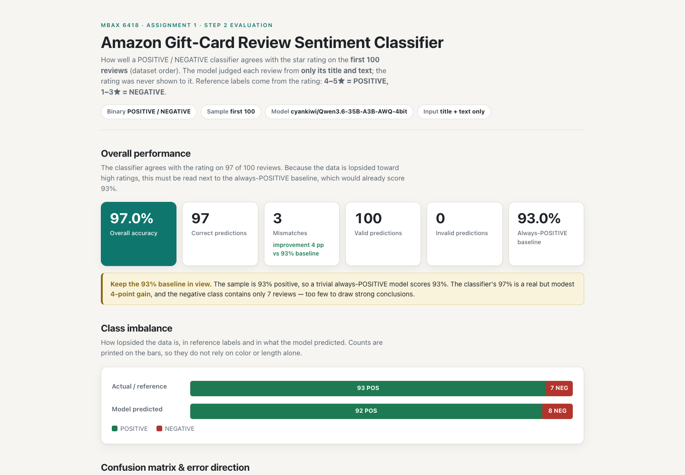
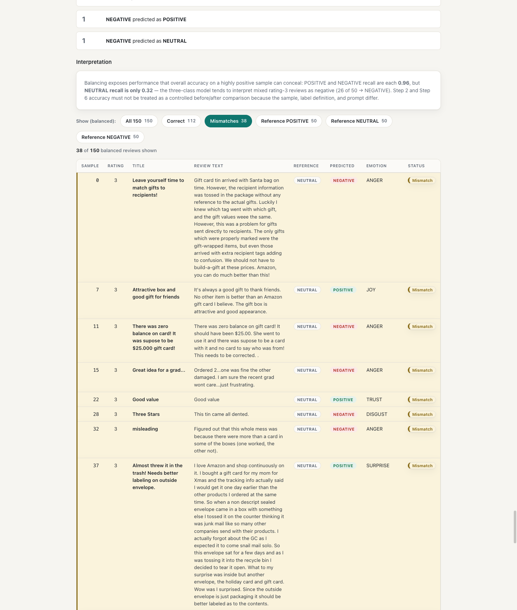
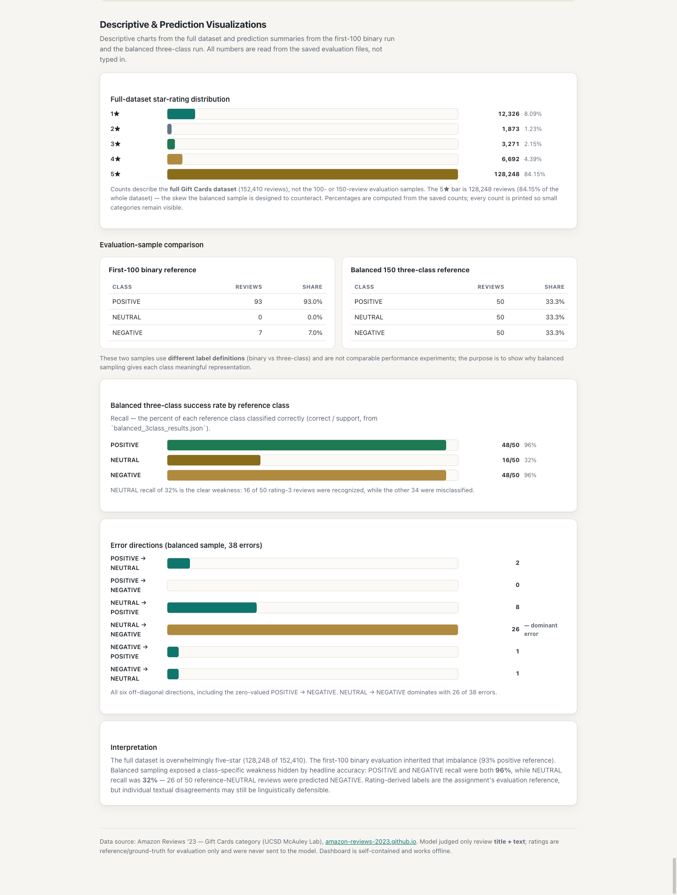

# MBAX 6418 — Assignment 1: Sentiment Classification of Amazon Gift-Card Reviews

Project folder for Assignment 1. Built and run with an AI agent (Hermes Agent).
Python is used for all classification/scoring code; model calls go through an
OpenAI-compatible endpoint.

## Data

- **Dataset:** Amazon Reviews '23 — "Gift Cards" category
  (McAuley Lab, UC San Diego). See the dataset page:
  <https://amazon-reviews-2023.github.io>
- **File:** `data/Gift_Cards.jsonl.gz` (gzipped JSON Lines; ~152,410 reviews),
  re-downloadable from
  <https://mcauleylab.ucsd.edu/public_datasets/data/amazon_2023/raw/review_categories/Gift_Cards.jsonl.gz>
- **Fields:** `rating, title, text, images, asin, parent_asin, user_id,
  timestamp (Unix ms), helpful_vote, verified_purchase`

## Setup and reproduction

**Python version:** developed on Python 3.11; anything 3.10+ should work.

**1. Create and activate a virtual environment**

```bash
python3.11 -m venv .venv
source .venv/bin/activate        # macOS / Linux
# Windows: .venv\Scripts\activate
```

**2. Install dependencies**

```bash
pip install -r requirements.txt
```

The only third-party runtime package is the `openai` client library (used by
`classifier.py`, `classifier_sentiment_emotion.py`,
`classifier_3class_emotion.py`). Everything else is Python standard library.

**3. Download the dataset into `data/`** (the `data/` directory is git-ignored
and must be re-created locally)

```bash
mkdir -p data
curl -L -o data/Gift_Cards.jsonl.gz \
  "https://mcauleylab.ucsd.edu/public_datasets/data/amazon_2023/raw/review_categories/Gift_Cards.jsonl.gz"
```

Expected structure: `data/Gift_Cards.jsonl.gz` (gzipped JSON Lines, ~152,410
reviews).

**4. Obtain the NRC Emotion Lexicon** (Step 5A2 only; git-ignored under `data/nrc/`)

The official source details, checksums, and download URL are saved in
`nrc_source_manifest.json`. Place the downloaded archive and extracted files at:

```bash
mkdir -p data/nrc
# download NRC-Emotion-Lexicon.zip per nrc_source_manifest.json into data/nrc/
# unzip it there, and validate with: python validate_nrc_lexicon.py
```

The lexicon is for non-commercial research/education use only; do not
redistribute the raw lexicon files.

**5. Set the API key without writing it into any tracked file**

```bash
export SENTIMENT_API_KEY="your-key-here"   # not committed anywhere
```

The key is read from the environment at runtime (see `classifier.py`). Do not
put it in `.env`, source files, or outputs. `SENTIMENT_API_KEY` is an
environment-variable name only — no secret value belongs in the repo.

**6. Which script reproduces which stage**

| Stage | Run command | Needs API key? |
|---|---|---|
| Step 1 classifier | `python classifier.py` (imported by other scripts) | yes |
| Step 1 spot-check | `python spot_check.py` | yes |
| Step 2 first-100 run | `python step2.py` | yes |
| Step 5A1 sentiment+emotion run | `python step5a1.py` | yes |
| Step 5A2b NRC scoring | `python score_nrc_emotions.py` | no |
| Step 5A3 comparison | `python compare_emotions.py` | no |
| Step 6A balanced sample | `python build_balanced_sample.py` | no |
| Step 6B balanced run | `python run_balanced_3class.py` | yes |
| Dashboard | `python generate_dashboard.py` | no |

Runners are checkpointed and resume-safe. **Verification scripts require no API
key:** `step2_verify.py`, `step5a1_verify.py`, `validate_nrc_lexicon.py`,
`step5a2b_verify.py`, `step5a3_verify.py`, `balanced_sample_verify.py`,
`step6b_verify.py`, `step6c_verify.py`, `step7_verify.py` — all run offline
against the saved result files.

**7. Regenerate / open the dashboard**

```bash
python generate_dashboard.py    # regenerates dashboard.html from saved results
open dashboard.html             # or double-click it in a file browser
```

The dashboard is a single self-contained HTML file (inline CSS/JS, no external
assets) and can be opened directly in any browser.

> **Reproducibility note:** deterministic settings (temperature 0, thinking
> disabled, fixed seeds, fixed row ordering) make re-runs stable *given the same
> endpoint and model*. Past outputs were produced against the course vLLM
> endpoint (`cyankiwi/Qwen3.6-35B-A3B-AWQ-4bit`); if that external service
> changes or becomes unavailable, re-running may not reproduce the saved
> predictions byte-for-byte. Equality of sampling and settings is guaranteed;
> equality of live model outputs is not.

## Step 1 — Structured binary classifier (given title + text)

A reusable, schema-constrained classifier that decides **POSITIVE** vs **NEGATIVE**
for a review using **only its `title` and `text`**. The model never sees the rating.

- **Binary task:** each review → `{"sentiment": "POSITIVE"}` or
  `{"sentiment": "NEGATIVE"}`.
- **Input restriction:** only `title` and `text`; no rating or other metadata is
  sent to the model. The rating is stored locally only as ground-truth for later
  evaluation.
- **Model / endpoint:** `cyankiwi/Qwen3.6-35B-A3B-AWQ-4bit` at
  `http://dobolyi.com:9001/v1` (OpenAI-compatible vLLM).
- **Settings:** `temperature=0` (deterministic), model **thinking disabled**
  (`extra_body={"chat_template_kwargs":{"enable_thinking":false}}`).
- **Structured output:** strict JSON schema — key `sentiment` required, value
  restricted to `"POSITIVE" | "NEGATIVE"`, `additionalProperties: false`
  (enforced by the server via `response_format`).
- **Prompt file (single source of truth):** `prompt_classifier.txt`. The harness
  `classifier.py` loads that file verbatim as the system prompt, so the executed
  prompt and the documented prompt cannot diverge.
- **API key:** read from the environment (`SENTIMENT_API_KEY`); never committed
  or written to output files.

**Spot-check result (Step 1):** a 12-review manual set spanning clearly positive,
clearly negative, terse, and conflicting-title/body reviews — all predictions
matched the expected label and all responses passed schema validation (12/12).
See `spot_check.py` and `spot_check_results.json`.

## Step 2 — Score against ratings (first 100 reviews)

Evaluate the binary classifier on exactly the **first 100 records in file order**
of `data/Gift_Cards.jsonl.gz`, each given a zero-based `row_index` (0–99, no
shuffle/balance/substitution/removal). Reference labels are derived **from the
rating after classification** — `rating >= 4 → POSITIVE`, `rating < 4 → NEGATIVE` —
and the rating/reference appear **only** as local evaluation data, never in any
field sent to the model.

**Results (from the saved output — see `step2_results.json`):**

| Metric | Value |
|---|---|
| Records | 100 |
| Valid predictions | 100 |
| Invalid predictions | 0 |
| Actual (reference) distribution | POSITIVE = 93, NEGATIVE = 7 |
| Predicted distribution | POSITIVE = 92, NEGATIVE = 8 |
| Correct predictions | 97 |
| **Overall accuracy** | **97/100 = 97.0%** |

**Confusion matrix (rows = actual/reference, columns = predicted):**

| Actual \ Predicted | POSITIVE | NEGATIVE |
|---|---:|---:|
| **POSITIVE** | 91 | 2 |
| **NEGATIVE** | 1 | 6 |

**Per-class precision / recall / F1:**

| Class | Support | Correct | Precision | Recall | F1 |
|---|---:|---:|---:|---:|---:|
| POSITIVE | 93 | 91 | 0.9891 | 0.9785 | 0.9838 |
| NEGATIVE | 7 | 6 | 0.7500 | 0.8571 | 0.8000 |

**Majority-class baseline & honest reading of imbalance:** the sample is heavily
skewed toward high ratings (93 of 100 references are POSITIVE). An **always-POSITIVE**
baseline would score **93.0%**; the model scores **97.0%** — an improvement of only
**4 percentage points** over that baseline. Because the negative class has just **7
examples**, the 97% headline alone is **not** evidence of strong performance; the
more meaningful signal is that the model did correctly identify **6 of the 7**
negative reviews (recall 0.857). The 3 mismatches:

| row | rating | reference | predicted | title |
|---|---:|---|---|---|
| 17 | 5 | POSITIVE | NEGATIVE | No note attached to sent gift card |
| 46 | 5 | POSITIVE | NEGATIVE | Love it!! |
| 98 | 3 | NEGATIVE | POSITIVE | Easy to use |

Rows 17 and 46 are mixed/sarcastic reviews where the body-trump rule yields a
NEGATIVE against a 5★; row 98 is a clearly positive 3★ review where the forced
binary `<4 → NEGATIVE` reference rule labels it NEGATIVE. The scoring scripts are
resumable (`step2.py` checkpoints each row and makes **zero** API calls when rows
0–99 are already complete; `raw_response`/`model` were not retained in the original
run and are therefore absent/not fabricated). Metrics are recomputed and verified
from the saved rows by `step2_metrics.py` and `step2_verify.py` respectively.

## Step 3 — Results dashboard

A polished, **self-contained** HTML dashboard that presents the 100-row binary
evaluation to a non-technical reader. **Open it by double-clicking
`dashboard.html`** — it works fully offline (no server, no external CSS/JS/fonts,
no CDN; the only network reference is a plain-text citation link to the dataset
page). Every number is read/calculated from `step2_results.json`; the generator
`generate_dashboard.py` asserts the key invariants (100 rows, 97 correct, 3
mismatches, 93/7 actual, 92/8 predicted, confusion diag 97, 93% baseline) and
**refuses to generate** if the data is inconsistent. It shows:

- **Overall performance** — 97.0% accuracy, 97 correct, 3 mismatches, 100 valid /
  0 invalid, next to the 93.0% always-POSITIVE baseline (+4 pp).
- **Class imbalance** — count-labelled stacked bars for actual (93/7) and
  predicted (92/8) distributions.
- **Confusion matrix & error direction** — 2×2 matrix (91/2 per positive row,
  1/6 per negative row) with the 3 mistakes explained in plain language.
- **Per-class metrics** — support, precision, recall, F1 for both classes, with a
  plain-language caution that the negative numbers rest on only 7 reviews.
- **The 3 mismatches** — rows 17, 46, 98 in full (row, rating, title, text,
  reference, predicted, error direction), framed as classifier-vs-rating
  disagreements, not "correct" answers.
- **All 100 reviews** — a readable scrollable table with row, rating, title,
  text, reference, predicted, and status.

The review table uses clean semantic HTML with `data-row` / `data-status` /
`data-reference` / `data-predicted` attributes to support Step 4 filtering later
(filter controls are **not** implemented in Step 3).

**Screenshots:** `screenshots/dashboard_desktop.png` and
`screenshots/dashboard_mobile.png` (checked at 1440px desktop and 390px mobile
widths — no clipping, no page-level horizontal overflow; the review table
scrolls inside its own wrapper on narrow screens).



## Step 4 — Interactive review filtering

The 100-review table now has client-side filtering **built into `dashboard.html`**
— it works fully offline with no server, network, or external dependencies. Above
the table are three real `<button>` controls derived programmatically from the
saved rows:

- **All reviews 100** (default)
- **Correct 97**
- **Mismatches 3**

Selecting a button shows only the matching rows, hides the rest, updates a live
count readout ("*Showing N of 100 reviews*"), and marks the active button with
`aria-pressed`. Filtering happens entirely in the browser — it never
reloads the page, never calls a model, and never modifies the saved results,
the shown metrics, or any row's content or classification. The three mismatch rows
are exactly row indices **17, 46, and 98**, and visible rows always stay in
ascending row-index order. Rows are hidden (not removed) so all 100 remain in the
DOM; if JavaScript is unavailable the full table still renders.

Accessibility: real keyboard-operable buttons, `role="group"` + visible label on
the control group, an `aria-live="polite"` region for the count, `aria-pressed`
for selected state, and `:focus-visible` outlines.

**Screenshots:** `screenshots/dashboard_step4_desktop.png`,
`screenshots/dashboard_step4_mobile.png`, and
`screenshots/dashboard_step4_mismatches.png` (the mismatch shot shows the
"Mismatches" filter selected with its "Showing 3 of 100" count).

## Step 5A1 — LLM sentiment & emotion predictions

For the **same fixed 100-review sample** (rows 0–99), the LLM makes a **fresh** request
per review returning a **binary sentiment** plus **one primary emotion**, using a
**separate extended prompt** (`prompt_classifier_sentiment_emotion.txt`) and a separate
classifier (`classifier_sentiment_emotion.py`). The approved Step 1 prompt/classifier
are untouched, and each model request carries **only the review's title and text** —
never the row index, rating, reference label, Step 2 prediction, correctness, or other
metadata. The Step 2 comparison happens only as local post-processing.

Allowed emotions (exactly one is chosen):
`ANGER, ANTICIPATION, DISGUST, FEAR, JOY, SADNESS, SURPRISE, TRUST`.

Results (from `step5a1_results.json`):
- **100 rows, 100 valid, 0 invalid**
- **Sentiment:** POSITIVE 92, NEGATIVE 8
- **Emotion:** JOY 68, TRUST 23, ANGER 6, DISGUST 2, ANTICIPATION 1 — and three
  **zero-count** emotions: **FEAR 0, SADNESS 0, SURPRISE 0**
- **Step 2 sentiment agreement:** **100/100 (100.0%)**, with an empty disagreement
  list (internal consistency check — no Step 2 prediction was sent to the model).

The runner `step5a1.py` is **resumable** — it checkpoints after each response, reuses
completed valid rows, retains `raw_response` and `model`, preserves exact invalid
responses, and makes **zero API calls** (no key required) when rows 0–99 are already
complete. Metrics are recomputed and verified from the saved rows by
`step5a1_verify.py`. **NRC word-list scoring is carried out separately in Step 5A2b.**

## NRC Emotion Lexicon — source note (Step 5A2a)

The emotion word list for Step 5A2b is the **official NRC Word-Emotion Association
Lexicon** (aka NRC Emotion Lexicon / EmoLex):

- **Resource:** NRC Word-Emotion Association Lexicon (EmoLex), version 0.92
  (released 10 July 2011)
- **Source:** <https://www.saifmohammad.com/WebPages/NRC-Emotion-Lexicon.htm>
  (direct download: `NRC-Emotion-Lexicon.zip` from the official site)
- **Attribution:** Dr. Saif M. Mohammad and Dr. Peter Turney, National Research
  Council Canada (Copyright © 2011 NRC)
- **License:** free for non-commercial research and educational purposes; **no
  redistribution** — direct interested parties to the lexicon home page.
- **Raw data location:** the downloaded archive, its extracted files, and the README
  live under the **Git-ignored** `data/nrc/` directory (see `.gitignore` `data/`) and
  are **not committed or redistributed**. Source/validation metadata is recorded in
  `data/nrc/nrc_source_manifest.json` and `data/nrc/nrc_lexicon_validation.json`.

No review-level NRC emotion scores are reported here; those are in the Step 5A2b section.

## Step 5A2b — NRC word-list emotion scoring

Scored the **same 100 reviews** (rows 0–99) with the official **NRC Word-Emotion
Association Lexicon, version 0.92** (from `data/nrc/`; source as recorded in the
NRC source note above and `nrc_source_manifest.json`). This method is **independent
of the LLM method** — it reads only `row_index`, `title`, and `text` from the Step 2
results and never touches `step5a1_results.json` or any LLM emotion. It makes **no
model/API calls**.

**Method (word-count, documented limitations):**
- Input = title + `\n` + text; HTML tags stripped via Python `html.parser` with
  `convert_charrefs=True` (entities/charrefs decoded, e.g. `&amp;` → `&`, `&#34;` →
  `"`), separator tags (`<br>`, `<br />`, `<p>`, `<div>`, `<li>`) contribute a space
  so words never concatenate, then a defensive `html.unescape`; lowercases.
- Token rule: `[a-z]+(?:'[a-z]+)?` — every occurrence counted (repeats included).
- **No stemming, lemmatization, stop-word removal, negation handling, or synonym
  expansion.** This is a literal word-count method: it does **not** understand
  context, sarcasm, phrasal meaning, or negation, and it counts a word even when the
  word is merely mentioned rather than expressed.
- A token associated with one emotion adds one to it; with multiple emotions it adds
  one to **each** (preserved). `matched_token_count` counts a matched token
  occurrence once regardless of how many emotions it fires.
- The NRC `positive`/`negative` sentiment categories are completely ignored.

**Tie / no-match policy** (deterministic canonical order: ANGER, ANTICIPATION, DISGUST,
FEAR, JOY, SADNESS, SURPRISE, TRUST): unique max → that emotion (tie=false); shared
max → all tied preserved in canonical order and the first selected (tie=true); all
zeros → `NO_MATCH`, empty top list, matched=0, tie=false.

**Results (from `step5a2b_results.json`):**
- Selected rows 100 · rows with ≥1 matched emotion token **85** · `NO_MATCH` **15**
- **Coverage 85.0%** · **ties 52**
- **NRC primary-emotion distribution:** ANTICIPATION 59, JOY 21, NO_MATCH 15,
  ANGER 2, DISGUST 1, SADNESS 1, TRUST 1, FEAR 0, SURPRISE 0
- **Tokens:** 2,171 total · 292 matched-token occurrences · match rate 13.45% ·
  avg 2.92 matched tokens/review (HTML cleaner uses `convert_charrefs=True` and
  inserts a space at separator tags like `<br />`, `<p>`, `<div>`, `<li>`; this
  split two previously-concatenated words — rows 7 and 9 — and changed the total
  token count from 2,169 to 2,171 with no change to any emotion score)
- `NO_MATCH` rows (15): 31, 34, 45, 49, 55, 67, 68, 69, 74, 77, 78, 79, 86, 97, 98
- Tie rows (52): every tie and NO_MATCH row is listed in `step5a2b_results.json`.

Results are independently recomputed and verified by `step5a2b_verify.py`. **No LLM
emotion is compared here** — the LLM vs NRC comparison is Step 5A3.

## Step 5A3 — LLM vs NRC emotion comparison

Compares the **locked LLM** emotions (`step5a1_results.json`) with the **locked NRC**
emotions (`step5a2b_results.json`), joined by `row_index`. **Neither method is treated
as ground truth** — this is a divergence analysis, not an accuracy claim. No model
calls, no rescoring; the rating is never read and never used as emotion ground truth.

**Eligibility rule:** a row is eligible for agreement iff the LLM response is valid
**and** `nrc_primary_emotion != "NO_MATCH"`. Of 100 rows: **85 covered** (eligible),
**15 NRC NO_MATCH** (agreement fields `null`, excluded from denominators).

**Agreement definitions (85 eligible):**
- **exact:** `llm_primary_emotion == nrc_primary_emotion` → **19/85 = 22.35%**
- **tie-aware:** `llm_primary_emotion ∈ nrc_top_emotions` → **63/85 = 74.12%**
- **Agreements recovered by tie-awareness: 44** (rows where LLM emotion was inside NRC's
  tied set but the canonical tie-break had selected a different primary).

**Emotion distributions (all 100):**
- **LLM:** JOY 68, TRUST 23, ANGER 6, DISGUST 2, ANTICIPATION 1, SADNESS 0, FEAR 0, SURPRISE 0
- **NRC selected primary:** ANTICIPATION 59, JOY 21, NO_MATCH 15, ANGER 2, DISGUST 1,
  SADNESS 1, TRUST 1, FEAR 0, SURPRISE 0

**Unique-vs-tied NRC maxima (eligible rows):**
| Group | Rows | Exact | Tie-aware |
|---|---:|---:|---:|
| Unique maximum | 33 | 17/33 = **51.52%** | 17/33 = **51.52%** |
| Tied maximum | 52 | 2/52 = **3.85%** | 46/52 = **88.46%** |

For unique NRC maxima, exact and tie-aware agree (as expected); for the 52 tied NRC
rows, the canonical tie-break rule makes exact agreement collapse to 3.85% while
tie-aware agreement (LLM emotion present in the tied set) is 88.46%.

**Representative divergences (transparently selected):**
- **Exact agreement (unique max)** — row 1 *"amazon gift card"*: LLM JOY, NRC primary
  JOY (top `[JOY]`, unique), both agree. The review is plainly positive; the single
  dominant NRC word-emotion and the LLM's context reading converge.
- **Exact agreement (tied max)** — row 35 *"Birthday surprise!"*: LLM JOY, NRC top
  `[JOY, SURPRISE]` tied, primary JOY → exact & tie-aware both true; surprising-but-good
  language lands on JOY in both.
- **Tie-break-sensitive** — row 0 *"Great gift"*: LLM JOY; NRC top `[ANTICIPATION, JOY,
  SURPRISE]` tied, primary ANTICIPATION (canonical order). exact false but tie-aware true:
  JOY is a tied max, just not the first tied emotion. The divergence is an artifact of
  the canonical tie-break order, not evidence the two methods disagree about JOY's role.
- **Tie-aware disagreement, unique NRC max** — row 4 *"Not $10 Gift Cards"*: LLM ANGER
  (frustrated, "embarrassed… weren't able to cover"), NRC primary JOY (unique) from
  words like "gift/giving". NRC counts isolated associations (many positive gift words);
  LLM reads the complaint and sarcasm-ish frustration. NRC does not model sentiment
  polarity, negation, or the overall negative arc.
- **Tie-aware disagreement, tied NRC max** — row 11 *"Giftcard"*: LLM TRUST ("valid,
  arrived promptly"), NRC top `[ANTICIPATION, JOY, SURPRISE]` tied, primary ANTICIPATION;
  LLM TRUST appears in none of the tied maxima (score TRUST=1, below the max). Both agree
  the review is mild; NRC sees no strong single emotion while the LLM must pick one.
- **NRC NO_MATCH** — row 31 *"So easy" / "Easy to do"*: LLM TRUST; NRC all-zero scores →
  `NO_MATCH` (no lexicon word associated), so agreement is `null` and the row is excluded.

**Methodological reading:** the LLM interprets phrases and context but is **forced to
select exactly one** emotion; NRC counts **isolated word associations** and does not
understand sarcasm, negation, or polarity. One NRC word can contribute to several
emotions, and NRC had **52 tied** reviews (its selected primary is sensitive to the
canonical tie-break order) and returned **NO_MATCH** for 15. Exact agreement is
therefore stricter and more tie-sensitive than tie-aware agreement. **High or low
agreement by itself does not prove one method is better** — they measure different
things. Results are independently verified by `step5a3_verify.py` and stored in
`step5a3_comparison.json`. Dashboard integration is deferred to Step 5B.

## Step 5B — Emotion results in the dashboard

The dashboard now integrates the locked emotion analysis (Steps 5A1–5A3) while
preserving every approved sentiment feature. It is still a single self-contained
`dashboard.html` that works fully offline (no external scripts, stylesheets, fonts,
images, or CDNs).

**Sentiment sections unchanged:** headline metrics, imbalance charts, confusion
matrix, per-class metrics, the 3 mismatch cards, palette and typography, responsive
layout, and the review filters with their verified counts (All 100 / Correct 97 /
Mismatches 3). The filter label now states explicitly that the controls select by
**sentiment result** (the emotion columns are informational and not filtered).

**Emotion section (after the sentiment analysis, before the review table):**
- **Overview:** 100 LLM valid emotion predictions, 85 NRC-covered reviews, 15 NRC
  `NO_MATCH`, 52 NRC ties, **exact agreement 19/85 = 22.35%**, **tie-aware agreement
  63/85 = 74.12%**, and **44 agreements recovered through tie awareness**. These are
  labelled **agreement, not accuracy** — neither method is emotion ground truth.
- **Exact vs tie-aware explained:** exact requires `LLM emotion == NRC selected primary`;
  tie-aware counts when the LLM emotion appears among all NRC emotions tied for the
  highest score. NRC's canonical tie-break is an implementation choice, not an emotion
  ranking; the 52 tied rows make exact agreement understate conceptual overlap.
- **Distributions:** side-by-side, count-labelled bars for all eight emotions (LLM:
  JOY 68, TRUST 23, ANGER 6, DISGUST 2, ANTICIPATION 1, FEAR 0, SADNESS 0, SURPRISE 0;
  NRC selected primary: ANTICIPATION 59, JOY 21, ANGER 2, DISGUST 1, SADNESS 1, TRUST 1,
  FEAR 0, SURPRISE 0, plus NO_MATCH 15). The NRC ANTICIPATION count is inflated by the
  52 ties and the tie-break order.
- **Unique vs tied:** unique NRC maxima 33 eligible → exact 17/33 = 51.52%, tie-aware
  17/33 = 51.52%; tied NRC maxima 52 eligible → exact 2/52 = 3.85%, tie-aware
  46/52 = 88.46%.
- **8×8 comparison matrix:** rows = LLM emotion, columns = NRC selected primary
  (eligible rows only, all eight emotions with zeros, 64 cells summing to 85; green
  diagonal = exact agreement). On narrow screens it scrolls inside its container.
- **Representative examples:** one per category — exact agreement, tie-break-sensitive,
  unique-maximum disagreement, tied-maximum disagreement, and NRC `NO_MATCH` — each with
  row, title, full text, LLM emotion, NRC primary, NRC top set, the eight-score vector,
  and the methodological reason.

**Review table extension:** each of the 100 rows now also shows **LLM emotion,
NRC primary, NRC top emotions, and emotion comparison status** (Exact agreement /
Tie-aware only / Disagreement / NRC no match) while preserving the sentiment reference,
prediction, and correctness fields. Counts verified in the rendered table: 15 `NRC no
match`, 44 `Tie-aware only`, 19 `Exact agreement`, 22 `Disagreement`.

**Screenshots:** `screenshots/dashboard_step5b_desktop.png`,
`screenshots/dashboard_step5b_mobile.png`, and
`screenshots/dashboard_step5b_emotions.png` (emotion section with agreement metrics
and distributions).

## Step 6A — Balanced three-class sample, prompt, and harness

**Three-class reference rule (evaluation only):** `rating 4–5 → POSITIVE`, `rating 3 →
NEUTRAL`, `rating 1–2 → NEGATIVE`. The rating is used only to construct the sample and
derive the saved reference label — it never enters a model request.

**Balanced sample** (`balanced_sample_3class.json`): fixed seed **6418**; read the
**entire** dataset (152,410 records) in file order, assign zero-based `source_row_index`,
derive class from rating, group by class, `random.Random(6418).sample(group, 50)` per
class in fixed order **POSITIVE → NEUTRAL → NEGATIVE**, combine, one seeded `shuffle`,
then `sample_index 0–149`. Exactly **50/50/50 = 150 unique reviews** (no selection by
title/text/length/product/model results). Saved metadata includes the source path, the
dataset **SHA-256** (`e03a258e…b7c2340`), seed, algorithm, class order, total record
count, full-dataset rating distribution, three-class distribution, selected counts, and
selected source-row indices per class. `build_balanced_sample.py` builds it;
`balanced_sample_verify.py` re-reads the dataset, **reruns the seed-6418 logic**, and
verifies every row and metadata field (checksum, 150 rows, 50/class, unique 0–149
`sample_index`, unique source indices, title/text/rating equality, reference rule,
sampling reproducibility) — **PASSED**, with zero network/model calls.

Full-dataset distributions: rating {1: 12,326, 2: 1,873, 3: 3,271, 4: 6,692,
5: 128,248}; three-class {POSITIVE 134,940, NEUTRAL 3,271, NEGATIVE 14,199}.

**Three-class prompt** (`prompt_classifier_3class_emotion.txt`, separate from the
locked binary prompts): uses only title and text; returns one of POSITIVE / NEUTRAL /
NEGATIVE plus one of the eight primary emotions. NEUTRAL is defined as genuinely mixed/
balanced (substantial positive and negative evidence, neither side dominating) or
primarily factual — with explicit rules that short reviews are not automatically
NEUTRAL, mild-but-clear directions stay POSITIVE/NEGATIVE, small complaints/compliments
inside otherwise-strong reviews don't flip the class, and title/body conflicts weight
detailed body evidence. Review content is treated as data, not instructions; the model
never infers or requests a star rating. Three concise synthetic examples (one per
class, none from the dataset) are embedded as contrastive few-shot. Strict output
schema: `{"sentiment": <POSITIVE|NEUTRAL|NEGATIVE>, "primary_emotion": <one of the
eight>}`, both required, `additionalProperties:false`.

**Harness** (`classifier_3class_emotion.py`): loads the new prompt verbatim; accepts
only title and text (no rating/reference/index parameter); approved endpoint/model;
key from environment; temperature 0; thinking disabled; strict schema-constrained
output; programmatic validation of both fields; returns sentiment, primary emotion,
validity, raw response, and model id. Its **validator tests cover all three sentiments,
all eight emotions, missing keys, extra keys, invalid casing, invalid sentiment,
invalid emotion, non-JSON, non-string, and empty output — 20/20 pass**. A **leakage
audit** on a real balanced-sample row confirms the constructed messages contain the
system prompt, a user payload whose JSON keys are exactly `title` and `text`, and the
output instruction — with no structured fields for rating, reference label, source row
index, sample index, or previous predictions (words inside customer review text are
permitted and are not metadata). **No Step 6 model calls have occurred yet.**

## Step 6B — Balanced three-class run

Classified the locked **150-review balanced sample** (50 POSITIVE / 50 NEUTRAL / 50
NEGATIVE, seed 6418) with the locked three-class prompt and harness
(`classify_3class(title, text)` only; rating/reference joined locally afterward and
never sent to the model; temperature 0, thinking disabled, strict schema, one request
per review). Checkpointed every response in `balanced_3class_results.json`.

**Integrity:** sample & prompt SHA-256 + settings recorded in run metadata and
verified before and after the run; sample verifier passed; all 150 responses
completed and valid (0 invalid, 0 failed).

**Results (all numbers from `balanced_3class_results.json`):**
- Correct: **112/150** · **accuracy 74.67%** · **majority-class baseline
  33.33%** (50/150) — the balanced run beats the trivial baseline by ~41 points,
  unlike the Step 2 run where the 93% baseline nearly matched the model.
- **3×3 confusion (reference × predicted):**

| | POSITIVE | NEUTRAL | NEGATIVE |
|---|---:|---:|---:|
| **POSITIVE** | 48 | 2 | 0 |
| **NEUTRAL** | 8 | 16 | 26 |
| **NEGATIVE** | 1 | 1 | 48 |

- **Per-class:** POSITIVE support 50, tp 48, prec **0.8421**, rec **0.9600**, F1 0.8972;
  NEUTRAL support 50, tp 16, prec 0.8421, rec **0.3200**, F1 0.4638; NEGATIVE support 50,
  tp 48, prec **0.6486**, rec 0.9600, F1 0.7742.
- **Macro:** precision 0.7776 · **balanced accuracy (macro recall) 74.67%** · macro F1 0.7117.
- **Neutral prediction distribution** (the 50 reference-NEUTRAL reviews): NEGATIVE **26**,
  POSITIVE **8**, NEUTRAL **16** (sum 50) — neutrals **collapse primarily into NEGATIVE**.
- **Largest confusion direction: NEUTRAL → NEGATIVE (26)**, i.e. 52% of true 3★ reviews
  were called negative.
- **Error directions:** POSITIVE→NEUTRAL 2, POSITIVE→NEGATIVE 0, NEUTRAL→POSITIVE 8,
  NEUTRAL→NEGATIVE 26, NEGATIVE→POSITIVE 1, NEGATIVE→NEUTRAL 1. Mismatch count: **38**
  (full list in the file).
- **LLM emotion distribution (150 valid):** ANGER 54, JOY 49, DISGUST 18, TRUST 15,
  SADNESS 7, ANTICIPATION 4, SURPRISE 3, FEAR 0.

**What the balanced run reveals that the 93%-positive first-100 run concealed:** the
first-100 sample was 93% positive, so the binary model's 97% looked excellent while
negative-class behavior (7 examples) was barely measurable. The balanced three-class run
shows the real failure mode: **true 3★ (NEUTRAL) reviews collapse into NEGATIVE** (26/50)
— the model reads a complaint inside an otherwise mixed review (e.g. row 0: "arrived on
time, however the recipient info was tossed in…") as overall negative. Recall on the
neutral class is only 0.32, and the negative class wins mostly by precision cost
(precision 0.6486 — 26 of its 74 predictions are actually neutral-reference). Lowest
recall class: **NEUTRAL** (0.32). Lowest precision class: **NEGATIVE** (0.6486).

**Comparison with Step 2 (cautious):** Step 2 used the first 100 rows with a binary
label rule (≥4 positive, else negative); Step 6 uses a different balanced sample and a
three-class rule. **The accuracy values are not directly comparable as if only one
condition changed** — the samples, label rules, and prompt all differ. The rating-derived
reference is not perfect linguistic ground truth; disagreements identify where the
model's textual interpretation and the rating-based reference part ways (e.g. a
mostly-positive review rated 3★ carries the reference label NEUTRAL while the model
reads the text as positive — both readings defensible).

Results are independently verified by `step6b_verify.py` (hashes, alignment, raw
re-parse, distributions, confusion, TP/FP/FN/precision/recall/F1, macro metrics,
error directions, neutral distribution, mismatch lists, no credentials) — **PASSED**,
with no network/model calls.

## Step 6C — Balanced three-class results in the dashboard

The dashboard now includes a clearly separated **"Balanced Three-Class Evaluation"**
section (after the emotion analysis and the first-100 review table), generated entirely
from `balanced_3class_results.json` (`generate_dashboard.py` asserts the locked Step 6B
metrics before writing HTML). It is a **different sample and label rule** from the
first-100 binary analysis: **150 reviews** sampled with seed **6418**
(50 POSITIVE / 50 NEUTRAL / 50 NEGATIVE), reference rule **ratings 4–5 → POSITIVE,
rating 3 → NEUTRAL, ratings 1–2 → NEGATIVE**, model input **title + text only**, and
results are **not directly comparable with Step 2** as though only one condition changed.

**Section contents (all numbers from the locked JSON):**
- **Summary cards:** 150 selected · 150 valid · 112 correct · 38 mismatches · **74.67%
  accuracy** · **33.33% majority-class baseline** · **+41.34 pp improvement** ·
  **balanced accuracy / macro recall 74.67%** · macro F1 **0.7117**.
- **Distributions:** reference POSITIVE 50 / NEUTRAL 50 / NEGATIVE 50; predicted
  POSITIVE 57 / NEUTRAL 19 / NEGATIVE 74 (count-labelled bars).
- **3×3 confusion matrix** (reference × predicted): POSITIVE 48/2/0, NEUTRAL 8/16/26,
  NEGATIVE 1/1/48 (diagonal 112, cells sum 150; green diagonal, printed values).
- **Per-class:** POSITIVE prec 0.8421 / rec 0.9600 / F1 0.8972; NEUTRAL prec 0.8421 /
  rec **0.3200** / F1 0.4638; NEGATIVE prec 0.6486 / rec 0.9600 / F1 0.7742 — with a
  note highlighting **neutral recall 0.32 as the major weakness**.
- **Neutral-class callout:** of the 50 rating-3 reviews, 16 were predicted NEUTRAL,
  **26 NEGATIVE**, 8 POSITIVE — **52% of rating-3 reviews classified as NEGATIVE**, only
  32% recognized as NEUTRAL; framed as disagreements with a rating-derived reference.
- **Six error directions** (sum 38) with **NEUTRAL → NEGATIVE (26)** highlighted as the
  dominant error.
- **Interpretation:** balancing exposes what 93%-positive accuracy concealed — POSITIVE
  and NEGATIVE recall are each 0.96, NEUTRAL recall is 0.32; mixed rating-3 reviews tend
  to read as negative; Step 2 vs Step 6 is not a controlled comparison.
- **Step 6C review table:** all **150** balanced reviews (sample index, rating, title,
  full text, reference, predicted sentiment, predicted emotion, status) in a separate
  table (never mixed with the first-100 rows), with its own **six filters — All 150 /
  Correct 112 / Mismatches 38 / Reference POSITIVE 50 / Reference NEUTRAL 50 / Reference
  NEGATIVE 50** and a live row count. These controls affect only the balanced table; the
  first-100 filters (All 100 / Correct 97 / Mismatches 3) still work unchanged.

The page remains a single self-contained `dashboard.html` that works offline (no
external scripts, stylesheets, fonts, images, or CDNs), with the same design language,
responsive behavior, and internal table scrolling on narrow screens. `step6c_verify.py`
independently verifies the generated HTML (150 rows with sample indices 0–149 once;
metrics, 3×3 matrix (9 cells sum 150, diagonal 112), six error directions summing to 38,
neutral distribution summing to 50, all six balanced filters plus the three first-100
filters, no external resources, and unchanged Step 6A/6B source hashes) — **PASSED**,
with no network/model calls.

**Screenshots:** `screenshots/dashboard_step6c_summary.png`,
`screenshots/dashboard_step6c_mismatches.png` (balanced table filtered to the 38
mismatches), and `screenshots/dashboard_step6c_mobile.png`.



## Step 7 — Descriptive & prediction visualizations

The dashboard now includes a **"Descriptive & Prediction Visualizations"** section
(after the balanced three-class evaluation) with charts generated entirely from the
saved files (`step2_results.json`, `balanced_sample_3class.json`,
`balanced_3class_results.json`) — no result constants are typed into the generator.

- **Full-dataset star-rating distribution** (from the balanced-sample metadata,
  describing the **entire Gift Cards dataset** of 152,410 reviews, not the evaluation
  samples): 1★ 12,326 (8.09%) · 2★ 1,873 (1.23%) · 3★ 3,271 (2.15%) · 4★ 6,692 (4.39%)
  · 5★ 128,248 (84.15%). Count-labelled bars with computed percentages printed on every
  row — the extreme **five-star skew is immediately obvious** while the small categories
  stay readable because every count and percentage is printed (no zero-width
  information loss).
- **Evaluation-sample comparison:** first-100 binary reference **93 POSITIVE / 7
  NEGATIVE** (sum 100) vs balanced 150 three-class reference **50 / 50 / 50** (sum 150),
  with a note that the two use different label definitions and are not comparable
  performance experiments — the point is why balanced sampling gives each class
  meaningful representation.
- **Balanced class-success rate by reference class** (recall = correct/support from
  `balanced_3class_results.json`): POSITIVE **48/50 = 96%** · NEUTRAL **16/50 = 32%** ·
  NEGATIVE **48/50 = 96%** — numerator/denominator labels retained, NEUTRAL weakness
  visually unmistakable.
- **Error directions** (all six off-diagonal, sum 38): POS→NEU 2, POS→NEG 0, NEU→POS
  8, NEU→NEG 26, NEG→POS 1, NEG→NEU 1 — every count printed including the zero, with
  **NEUTRAL → NEGATIVE (26) marked as the dominant error**.
- **Interpretation:** the full dataset is overwhelmingly five-star; the first-100 binary
  evaluation inherited that imbalance; balanced sampling exposed a class-specific
  weakness hidden by headline accuracy (96% / 32% / 96% recall; 26 of 50 reference-
  NEUTRAL reviews predicted NEGATIVE); rating-derived labels are the evaluation
  reference, but individual textual disagreements may still be linguistically
  defensible. **No claim that Step 2 vs Step 6 is a controlled before/after comparison.**

The page remains self-contained and offline; the existing Step 1–6C content and both
filter systems are untouched. `step7_verify.py` independently verifies the HTML:
rating counts sum to 152,410 with every count and computed percentage present; first-100
93/7 (sum 100) and balanced 50/50/50 (sum 150); success labels 48/50, 16/50, 48/50 match
the JSON diagonal/support; six error directions match the JSON and sum to 38; still 100
original + 150 balanced rows; CSS hides both `.reviewrow.tr-hidden` and
`.b6row.tr-hidden`; no external resources; locked hashes unchanged — **PASSED** with no
network/model calls.

**Screenshots:** `screenshots/dashboard_step7_descriptive.png` (star-rating
distribution and class-success charts) and `screenshots/dashboard_step7_mobile.png`
(responsive readability of the Step 7 section).



## Final Findings and Assignment Questions

### A. Why did the lopsided run look very accurate, and what changed with equal sampling?

The first-100 evaluation (Step 2) was heavily lopsided: **93 of the 100 reviews
had a POSITIVE reference label** (rating ≥ 4) and only 7 were NEGATIVE. On that
sample the model scored **97% accuracy** — but a trivial **always-POSITIVE
baseline would already score 93%**, so the model's edge over the baseline was
only +4 percentage points. High overall accuracy on this sample mostly reflects
how common positive reviews are in this dataset, not how skilled the classifier
is at the hard cases.

Step 6 changed the sampling so each reference class is equally represented —
**50 POSITIVE / 50 NEUTRAL / 50 NEGATIVE** — and used a three-class label rule
(with NEUTRAL) and a new prompt, so it is **not a controlled comparison with
Step 2**: the sample, the label rule, and the prompt all differ. What balanced
sampling revealed is that per-class performance is very unequal: **POSITIVE and
NEGATIVE recall were 96% each, but NEUTRAL recall was only 32%**, pulling
overall accuracy down to **74.67% versus a 33.33% always-majority baseline**
(+41.34 pp). The lopsided Step 2 sample simply had almost no neutral reviews to
trip over.

### B. Which classes were confused, and in what direction?

Reference (actual) classes are rows; predicted classes are columns:

| Reference \ Predicted | POSITIVE | NEUTRAL | NEGATIVE |
|---|---|---|---|
| **POSITIVE** (50) | 48 | 2 | 0 |
| **NEUTRAL** (50) | 8 | 16 | 26 |
| **NEGATIVE** (50) | 1 | 1 | 48 |

Six error directions (all off-diagonal, sum = 38):

- POSITIVE → NEUTRAL: 2
- POSITIVE → NEGATIVE: 0
- NEUTRAL → POSITIVE: 8
- **NEUTRAL → NEGATIVE: 26 (dominant error)**
- NEGATIVE → POSITIVE: 1
- NEGATIVE → NEUTRAL: 1

The dominant failure is clear and one-directional: **26 of the 50
reference-NEUTRAL reviews were predicted NEGATIVE** (and 8 more were predicted
POSITIVE, so only 32% of neutral reviews were recognized as neutral). POSITIVE
and NEGATIVE classes were each recovered at **96% recall**, while NEUTRAL
recall was **32%**. The extreme five-star skew of the full dataset
(84.15% five-star) explains part of this: real five-star reviews that are
predicted NEGATIVE or NEUTRAL are rare, but genuinely mixed/neutral reviews are
dominated by disappointed or critical language, which the model over-weights
toward NEGATIVE.

### C. How did LLM and NRC emotions differ, and why?

Step 5A1 asked the LLM to pick one primary emotion per review; Step 5A2b scored
the same 100 reviews with the NRC Emotion Lexicon word list; Step 5A3 compared
them on the eligible rows.

- NRC word-list coverage: **85 / 100** reviews had at least one matched lexicon
  term; **15 had NO_MATCH**, and **52 had tied maxima**.
- Exact agreement between LLM primary emotion and NRC primary emotion
  (canonical tie-break): **19 / 85 = 22.35%**.
- Tie-aware agreement (LLM matches *any* tied co-maximum): **63 / 85 = 74.12%**;
  tie-aware agreement recovered 44 additional rows.

The methods differ by design. **NRC** counts isolated word→emotion associations
from a fixed lexicon: it cannot read context, negation ("not good"), sarcasm,
or the balance of a mixed review, and it frequently produces ties or no match at
all. **The LLM** interprets the whole title + text in context and is forced to
choose exactly one emotion, so it never returns a tie or "none" — but that
"always picks one" behavior is a constraint, not proof of correctness. Neither
method is treated as emotion ground truth. Some straightforward positive/joy
reviews produced agreement, while tied NRC maxima, negation, contextual
interpretation, and mildly expressed emotions produced many divergences.

### D. What bugs/issues occurred and how were they handled?

- **Mangled dataset URL.** The original link was truncated; corrected to
  `https://mcauleylab.ucsd.edu/public_datasets/data/amazon_2023/raw/review_categories/Gift_Cards.jsonl.gz`.
- **Thinking-model responses returned no content.** The endpoint model is a
  reasoning model; early calls drained `max_tokens` into a hidden reasoning
  trace and returned `content=None`. Fixed by disabling thinking via
  `extra_body={"chat_template_kwargs":{"enable_thinking":false}}`, verified
  with a probe call.
- **Severe class imbalance.** 84.15% of the full dataset is five-star, and the
  first-100 sample was 93% POSITIVE reference. Handled with a documented
  majority-class baseline (93%) and a deterministically balanced 50/50/50
  three-class sample (Step 6A) that exposed the NEUTRAL weakness.
- **Neutral-example prompt correction.** The three-class prompt's synthetic
  NEUTRAL example was internally inconsistent; replaced with a corrected
  synthetic example demonstrating sentiment/emotion separation, and verified
  the text matches no dataset or sample review.
- **NRC lexicon HTML token-separator issue.** Review HTML was being stripped, but
  separator tags such as `<br>`, `<p>`, `<div>`, and `<li>` did not consistently
  insert spaces, which caused two instances of adjacent words to concatenate. The
  cleaner was corrected to use proper entity conversion and separator spacing;
  the total token count changed from 2,169 to 2,171 with no change to any emotion
  score or conclusion, and the corrected scoring was independently verified.
- **Dashboard mismatch-filter CSS bug.** The Step 6C filter updated the live
  count but `.b6row` rows stayed visible because the hiding rule only covered
  `.reviewrow.tr-hidden`; fixed with `.b6row.tr-hidden{display:none}` and
  verified by actual rendered visibility in a browser.
- **Step 7 rounding inconsistency.** A chart row said 84.15% while a caption
  said 84.14% for 128,248 / 152,410; standardized to two-decimal rounding
  (84.15%) and made the caption compute from saved data.

Each issue was caught by a combination of saved outputs, independent offline
verifiers (one per step), programmatic browser checks of the rendered page, and
visual inspection of the actual saved screenshots.

## Files

- `prompt_classifier.txt` — the reusable Step 1 prompt (executed verbatim).
- `classifier.py` — Step 1 harness (`classify(title, text)`).
- `spot_check.py`, `spot_check_results.json` — Step 1 spot-check.
- `step2.py` — Step 2 scoring (first 100 rows, resumable, checkpointed).
- `step2_results.json` — Step 2 authoritative output (rows + summary + numeric metrics).
- `step2_metrics.py` — recomputes/stores Step 2 metrics from the saved rows.
- `step2_verify.py` — independent verification of Step 2 metrics (asserts loudly).
- `generate_dashboard.py` — generates the Step 3/4/5B/6C/7 dashboard (sentiment + emotion + balanced 3-class + descriptive charts) from the locked result files.
- `dashboard.html` — the self-contained offline dashboard (sentiment analysis, Step 4 filtering, Step 5B emotion analysis, Step 6C balanced evaluation, Step 7 descriptive visualizations).
- `screenshots/dashboard_desktop.png`, `screenshots/dashboard_mobile.png` — Step 3 screenshots.
- `screenshots/dashboard_step4_desktop.png`, `screenshots/dashboard_step4_mobile.png`,
  `screenshots/dashboard_step4_mismatches.png` — Step 4 filtering screenshots.
- `screenshots/dashboard_step5b_desktop.png`, `screenshots/dashboard_step5b_mobile.png`,
  `screenshots/dashboard_step5b_emotions.png` — Step 5B emotion-integration screenshots.
- `prompt_classifier_sentiment_emotion.txt` — Step 5A1 extended prompt (binary sentiment + one emotion).
- `classifier_sentiment_emotion.py` — Step 5A1 classifier (`classify_sentiment_emotion`).
- `step5a1.py` — Step 5A1 runner (resumable, checkpointed, title+text only).
- `step5a1_results.json` — Step 5A1 authoritative output (normalized fields + numeric metrics).
- `step5a1_verify.py` — independent verification of Step 5A1 predictions/metrics (asserts loudly).
- `validate_nrc_lexicon.py` — validates the official NRC Emotion Lexicon word-level file (Step 5A2a).
- `score_nrc_emotions.py` — Step 5A2b NRC word-list scoring (independent of the LLM).
- `step5a2b_results.json` — Step 5A2b authoritative output (per-row scores + aggregate metrics).
- `step5a2b_verify.py` — independent verification of NRC scoring (asserts loudly, no model calls).
- `nrc_source_manifest.json` — submission-safe NRC source metadata (repo root; raw lexicon stays git-ignored in `data/nrc/`).
- `compare_emotions.py` — Step 5A3 LLM vs NRC comparison (reads the two locked outputs, joins by row_index).
- `step5a3_comparison.json` — Step 5A3 authoritative output (combined rows, agreement metrics, cross-tab, subgroups).
- `step5a3_verify.py` — independent verification of Step 5A3 comparison (asserts loudly, no model calls).
- `build_balanced_sample.py` — Step 6A balanced 50/50/50 three-class sample builder (seed 6418, full dataset).
- `balanced_sample_3class.json` — Step 6A sample (150 rows + metadata incl. dataset SHA-256).
- `balanced_sample_verify.py` — independent verification of the balanced sample (reruns seed-6418 logic).
- `prompt_classifier_3class_emotion.txt` — Step 6A three-class sentiment + emotion prompt (with synthetic examples).
- `classifier_3class_emotion.py` — Step 6A three-class harness (strict schema, validator tests, leakage audit; no calls yet).
- `run_balanced_3class.py` — Step 6B runner (checkpointed, hashes/settings verified, title+text only).
- `balanced_3class_results.json` — Step 6B authoritative output (150 rows + numeric metrics + run metadata).
- `step6b_verify.py` — independent verification of the balanced three-class run (asserts loudly, no model calls).
- `step6c_verify.py` — independent verification of the Step 6C dashboard HTML (asserts loudly, no model calls).
- `screenshots/dashboard_step6c_summary.png`, `screenshots/dashboard_step6c_mismatches.png`,
  `screenshots/dashboard_step6c_mobile.png` — Step 6C dashboard screenshots.
- `step7_verify.py` — independent verification of the Step 7 visualization HTML (asserts loudly, no model calls).
- `screenshots/dashboard_step7_descriptive.png`, `screenshots/dashboard_step7_mobile.png` — Step 7 dashboard screenshots.
- `requirements.txt` — third-party runtime dependencies (only `openai`).
- `SUBMISSION_MANIFEST.md` — submission checklist: deliverables, authoritative results, excluded files, offline verification commands.
- `data/` — raw dataset (large, re-downloadable, git-ignored).
