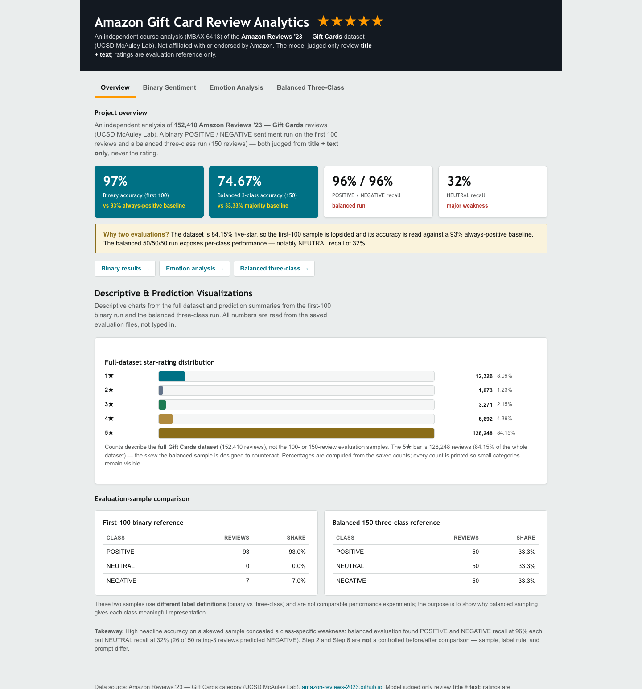
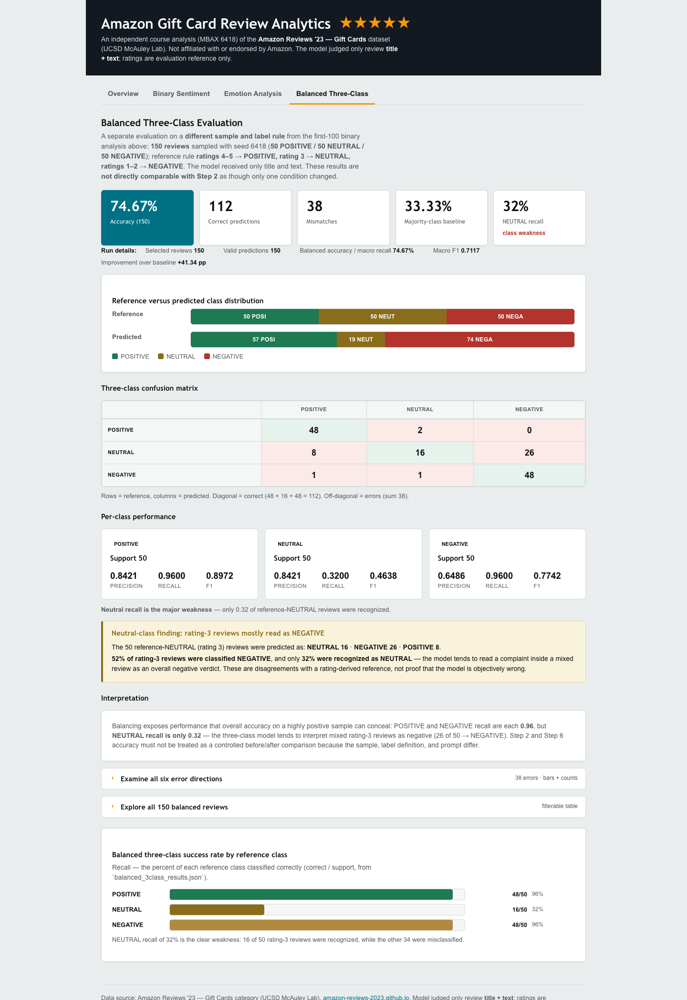

# Amazon Gift Card Review Analytics

Sentiment and emotion classification of **Amazon Reviews '23 — Gift Cards**
(McAuley Lab, UC San Diego), with a binary POSITIVE/NEGATIVE evaluation on the
first 100 reviews and a balanced three-class evaluation on a fixed 150-review
sample, plus a comparison of LLM-assigned primary emotions against the NRC
Emotion Lexicon. All results are presented in a self-contained offline
dashboard.

For every classification, the model received **only the review's title and
text** — never the rating or any other metadata. Star ratings were used only
afterward, as the evaluation reference.

This is an independent course project, not affiliated with or endorsed by
Amazon.

## Final dashboard

Open the [interactive dashboard](https://maddie-savary.github.io/mbax-6418-amazon-review-analytics/dashboard.html) — it is a single self-contained HTML file (inline CSS and JavaScript, no external assets) that also works offline from `dashboard.html` in the repository.

The dashboard has four accessible tabs, with URL-hash navigation
(`#overview`, `#binary`, `#emotions`, `#balanced`):

- **Overview** — project context, headline metrics, the full-dataset star-rating
  distribution, and the first-100 vs balanced-sample comparison.
- **Binary Sentiment** — the first-100 evaluation: accuracy against baseline,
  class distribution, confusion matrix, per-class metrics, and the three
  mismatches.
- **Emotion Analysis** — LLM vs NRC agreement, both emotion distributions, the
  comparison matrix, representative examples, and a row-level emotion-evidence
  table.
- **Balanced Three-Class** — the 150-review evaluation: methodology, metrics,
  confusion matrix, per-class performance, error directions, and all 150 rows.

Each tab keeps the core results visible and moves supporting evidence into
expandable disclosure sections. Both review tables have interactive filters
with live counts (binary: 100 / 97 / 3; balanced: 150 / 112 / 38 / 50 / 50 /
50), and filter state is preserved while navigating.





[DEVELOPMENT_NOTES.md](DEVELOPMENT_NOTES.md) preserves the complete development
history, audits, and intermediate screenshots; [SUBMISSION_MANIFEST.md](SUBMISSION_MANIFEST.md)
is the exhaustive file inventory with offline verification commands.

## Dataset and evaluation design

- **Source:** Amazon Reviews '23 — Gift Cards category, McAuley Lab, UC San
  Diego. Dataset page: <https://amazon-reviews-2023.github.io>; raw file:
  <https://mcauleylab.ucsd.edu/public_datasets/data/amazon_2023/raw/review_categories/Gift_Cards.jsonl.gz>
- **Size:** 152,410 reviews (rating, title, text, plus metadata fields).
- **Skew:** the full dataset is overwhelmingly positive — 5-star reviews are
  84.15% of the total (128,248 of 152,410).
- **Binary first-100 rule:** ratings 4–5 → POSITIVE, 1–3 → NEGATIVE. Exactly the
  first 100 records in file order, rows 0–99.
- **Balanced three-class rule:** ratings 4–5 → POSITIVE, 3 → NEUTRAL, 1–2 →
  NEGATIVE. A deterministic 150-review sample, 50 per class, fixed seed 6418.
- Ratings were applied only after inference, as the evaluation reference.

The two evaluations differ in sample, label rule, and prompt, so their accuracy
numbers are not a controlled before/after comparison.

## Methods

### LLM classification

- Model `cyankiwi/Qwen3.6-35B-A3B-AWQ-4bit` on the course OpenAI-compatible
  vLLM endpoint, `temperature 0`, one review per request, thinking disabled
  (without this the reasoning-model deployment returned no usable content).
- Input: title + text only. Output: server-enforced structured JSON with
  `additionalProperties: false`.
- Prompts are stored as files and loaded verbatim by the harnesses, so the
  executed prompt always equals the documented one
  (`prompt_classifier.txt`, `prompt_classifier_sentiment_emotion.txt`,
  `prompt_classifier_3class_emotion.txt`).
- API key is read from the `SENTIMENT_API_KEY` environment variable and never
  committed.

### NRC emotion scoring

- Official NRC Emotion Lexicon (Mohammad & Turney, NRC Canada) — eight
  categories: anger, anticipation, disgust, fear, joy, sadness, surprise,
  trust.
- Reviews are tokenized and scored by word association; the highest-scoring
  category is the NRC primary emotion.
- Ties are common (multiple categories share the maximum) and some reviews have
  no matching word at all (NO_MATCH).
- NRC is a word-association baseline, not emotion ground truth; the LLM is not
  treated as ground truth either — the comparison reports agreement.

### Dashboard

- Generated from the saved result JSONs by `generate_dashboard.py`; every
  displayed number comes from saved data.
- Self-contained, offline, responsive, with accessible tabs, filters, and
  native disclosure controls.

## Key results

### Binary first-100

| Metric | Value |
|---|---|
| Reference distribution | 93 POSITIVE / 7 NEGATIVE |
| Accuracy | 97 / 100 = **97%** |
| Always-positive baseline | 93% (improvement +4 pp) |
| Predicted distribution | 92 POSITIVE / 8 NEGATIVE |

Confusion matrix (rows = reference, columns = predicted):

| | POSITIVE | NEGATIVE |
|---|---:|---:|
| **POSITIVE** (93) | 91 | 2 |
| **NEGATIVE** (7) | 1 | 6 |

Per class: POSITIVE precision 0.9891 / recall 0.9785 / F1 0.9838; NEGATIVE
precision 0.7500 / recall 0.8571 / F1 0.8000 (7 examples only).

### Balanced three-class

| Metric | Value |
|---|---|
| Sample | 50 POSITIVE / 50 NEUTRAL / 50 NEGATIVE |
| Accuracy | 112 / 150 = **74.67%** |
| Majority-class baseline | 33.33% (improvement +41.34 pp) |
| Balanced accuracy / macro recall | 74.67% |
| Macro F1 | 0.7117 |
| Predicted distribution | 57 POSITIVE / 19 NEUTRAL / 74 NEGATIVE |

Confusion matrix (rows = reference, columns = predicted):

| | POSITIVE | NEUTRAL | NEGATIVE |
|---|---:|---:|---:|
| **POSITIVE** (50) | 48 | 2 | 0 |
| **NEUTRAL** (50) | 8 | 16 | 26 |
| **NEGATIVE** (50) | 1 | 1 | 48 |

Recall: POSITIVE **96%**, NEUTRAL **32%**, NEGATIVE **96%**. (Full
precision/recall/F1 per class is in the dashboard.)

### LLM vs NRC emotions (first 100)

| Metric | Value |
|---|---|
| NRC-covered reviews | 85 / 100 |
| NRC NO_MATCH | 15 |
| NRC tied maxima | 52 |
| Exact agreement | 19 / 85 = **22.35%** |
| Tie-aware agreement | 63 / 85 = **74.12%** |

## Assignment questions and findings

### 1. Why did the lopsided run look so accurate?

The first-100 sample was 93% positive, so a rule that always answers POSITIVE
already scores 93%. The model's 97% is a real but modest four-point gain over
that baseline — it mostly reflects how common positive reviews are, not strong
class discrimination. Balanced sampling gives every class equal representation,
and under that design accuracy drops to 74.67% against a 33.33% majority
baseline. Step 2 and Step 6 are not a controlled before/after experiment: the
sample, label definition, and prompt all differ.

### 2. Which classes were confused, and in what direction?

The dominant error is **NEUTRAL → NEGATIVE**: 26 of the 50 reference-NEUTRAL
reviews were predicted NEGATIVE, and 8 more were predicted POSITIVE — only
16 of 50 were recognized as NEUTRAL. POSITIVE and NEGATIVE recalls were both
96%, while NEUTRAL recall was 32%. These are disagreements between the model's
reading of the text and a rating-derived reference — the reference is a useful
evaluation target but not perfect linguistic truth, and some individual
disagreements are linguistically defensible.

### 3. How did LLM and NRC emotions differ?

NRC counts isolated word-to-emotion associations from a fixed lexicon: it
cannot interpret context, negation, sarcasm, or an overall narrative, it often
produces tied maxima, and sometimes finds no matching word at all. The LLM
interprets the whole review but must choose exactly one emotion, so it never
returns a tie or "none." Exact agreement was only 22.35% and was highly
sensitive to NRC's canonical tie-break; counting the LLM's emotion among any
NRC tied maximum raises agreement to 74.12%. Neither method is emotion ground
truth.

### 4. What issues occurred and how were they addressed?

The dataset URL was initially mangled and corrected to the canonical source
link. The endpoint model initially consumed output tokens on a hidden reasoning
trace until thinking was disabled. The 84.15% five-star skew made headline
accuracy misleading, so baselines and deterministic balanced sampling were
added. A synthetic NEUTRAL example in the three-class prompt was internally
inconsistent and was replaced. NRC tokenization occasionally concatenated words
across HTML separator tags; correcting it changed the token count from 2,169 to
2,171 without changing any emotion scores. A dashboard CSS bug left balanced
rows visible after filtering (`.b6row.tr-hidden` was missing) and was fixed.
Finally, 128,248 / 152,410 was once reported as both 84.14% and 84.15%; the
rounding was standardized and the caption now computes from saved data. These
were caught through saved outputs, independent offline verifiers per stage,
browser testing of the rendered page, and visual review of screenshots.

## Setup and reproduction

Tested with Python 3.11 (3.10+ should work).

```bash
python3.11 -m venv .venv
source .venv/bin/activate          # Windows: .venv\Scripts\activate
pip install -r requirements.txt    # only third-party dep: the openai client
```

Download the dataset (git-ignored under `data/`):

```bash
mkdir -p data
curl -L -o data/Gift_Cards.jsonl.gz \
  "https://mcauleylab.ucsd.edu/public_datasets/data/amazon_2023/raw/review_categories/Gift_Cards.jsonl.gz"
```

For the NRC stage, download `NRC-Emotion-Lexicon.zip` per
`nrc_source_manifest.json` into `data/nrc/` (non-commercial research/education
use only; the raw lexicon is not redistributed).

Set the API key without writing it into any tracked file:

```bash
export SENTIMENT_API_KEY="your-key-here"
```

| Stage | Command | Needs API key |
|---|---|---|
| Binary first-100 run | `python step2.py` | yes |
| Sentiment + emotion run | `python step5a1.py` | yes |
| NRC word-list scoring | `python score_nrc_emotions.py` | no |
| LLM vs NRC comparison | `python compare_emotions.py` | no |
| Balanced sample build | `python build_balanced_sample.py` | no |
| Balanced three-class run | `python run_balanced_3class.py` | yes |
| Regenerate dashboard | `python generate_dashboard.py` | no |

Offline verification (no API key, no network): `step2_verify.py`,
`step5a1_verify.py`, `validate_nrc_lexicon.py`, `step5a2b_verify.py`,
`step5a3_verify.py`, `balanced_sample_verify.py`, `step6b_verify.py`,
`step6c_verify.py`, `step7_verify.py`, `dashboard_tabs_verify.py`.

Deterministic settings make re-runs stable on the same endpoint, but live model
outputs depend on the external course service — if the endpoint or model
changes, re-running may not reproduce the saved predictions byte-for-byte.

## Main files

- **Prompts:** `prompt_classifier.txt`, `prompt_classifier_sentiment_emotion.txt`,
  `prompt_classifier_3class_emotion.txt`.
- **Classifiers and runners:** `classifier.py`, `classifier_sentiment_emotion.py`,
  `classifier_3class_emotion.py`, `spot_check.py`, `step2.py`, `step5a1.py`,
  `build_balanced_sample.py`, `run_balanced_3class.py`.
- **NRC scoring / comparison:** `validate_nrc_lexicon.py`, `score_nrc_emotions.py`,
  `compare_emotions.py`, `nrc_source_manifest.json`.
- **Authoritative saved outputs:** `step2_results.json`, `step5a1_results.json`,
  `step5a2b_results.json`, `step5a3_comparison.json`,
  `balanced_sample_3class.json`, `balanced_3class_results.json`.
- **Dashboard:** `generate_dashboard.py`, `dashboard.html`,
  `screenshots/` (final tab screenshots).
- **Verification:** the `*_verify.py` scripts listed above.
- **Documentation:** this README, `DEVELOPMENT_NOTES.md` (full history),
  `SUBMISSION_MANIFEST.md` (complete inventory).

## Sources

- Amazon Reviews '23 dataset page: <https://amazon-reviews-2023.github.io>
- Gift Cards raw file:
  <https://mcauleylab.ucsd.edu/public_datasets/data/amazon_2023/raw/review_categories/Gift_Cards.jsonl.gz>
- NRC Emotion Lexicon (Mohammad & Turney, NRC Canada):
  <https://www.saifmohammad.com/WebPages/NRC-Emotion-Lexicon.htm>

The NRC lexicon is free for non-commercial research and education; the raw
lexicon files are not redistributed in this repository (see
`nrc_source_manifest.json`).
